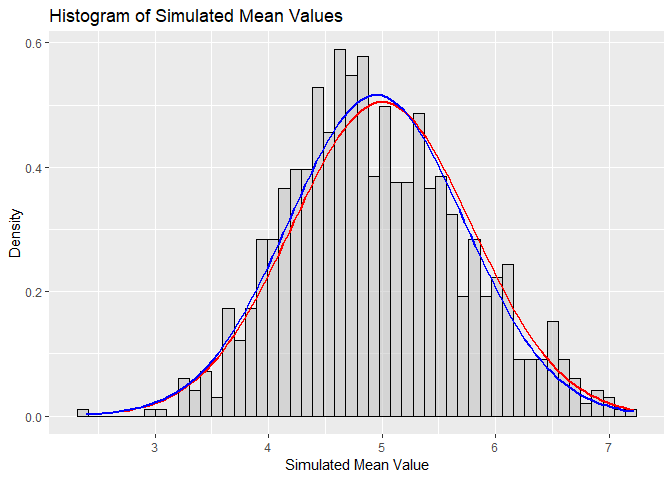
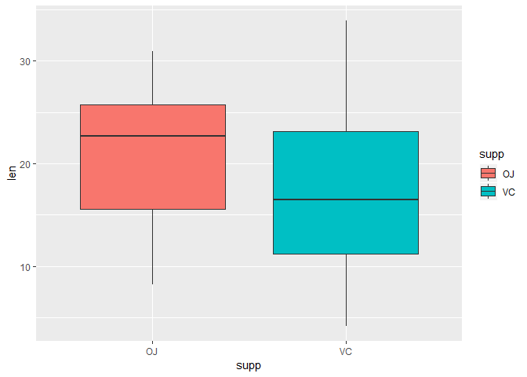
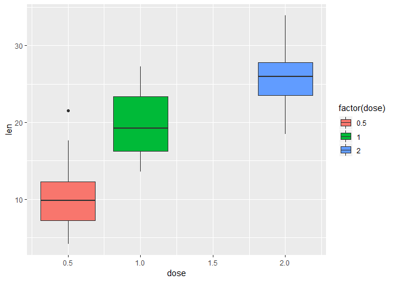

## Introduction

This is a report submitted to fulfill the requirements of the Statistical Inference course offered by Johns Hopkins University on Coursera. It covers some basic simulation and exploratory data analysis techniques, as well as a more involved statistical analysis. The report is divided into two sections, each of which will be discussed separately.

## Data Simulation and Exploration

For this exercise, data are simulated using the exponential distribution, and the mean value of 40 simulations are calculated. This is repeated 1000 times. The mean and variance of the simulated data are calculated, and these are compared with the mean ond variance values obtained through calculations.

Before starting, the necessary libraries must be loaded into R. Please note that the same libraries will also be used for the next section of the project and so they will only be loaded once.


```r
library(ggplot2)
```

```
## Warning: package 'ggplot2' was built under R version 3.5.1
```

```r
library(datasets)
```

### Simulation 

The R code below is used to generate the simulated data to be used according the the exponential distribution specified. In this case, lambda = 0.2 and the number of samples (n) = 40.


```r
set.seed(1986)
exponentials <- 40
lambda <- 0.2
sims <- 1000    # number of simulations to run

# create a blank data frame for the simulated data
simulated_Data <- data.frame(ncol=2, nrow=sims)
names(simulated_Data) = c("simulation number", "simulated mean")

# using a for loop, populate the new data frame with the simulated exponential distribution data
for(i in 1:sims) {
  simulated_Data[i,1] <- i
  simulated_Data[i,2] <- mean(rexp(exponentials, lambda))
}
```

### Comparison of the Mean Values

The variance for the simulated data is calculated using the built-in "var" function, while the theoretical variance is calculated from fiirst principles. In this case, the mean is calculated b y 1/lambda, where lambda = 0.2.


```r
# calculate and display the mean value of the simulated data
sim_Mean <- mean(simulated_Data[,2])
sim_Mean
```

```
## [1] 4.95159
```

```r
# calculate and display the mean of the theoretical data according to the equation 1/lambda
test_Mean <- 1/lambda
test_Mean
```

```
## [1] 5
```

```r
# calculate and display the differnce in the simulated and theoretical mean values
diff_Mean <- test_Mean - sim_Mean
diff_Mean
```

```
## [1] 0.04841026
```

The theoretical and simulation values are very close, which indicates that the two are very good approximations of each other. 

### Comparison of the Variance Values

The variance for the simulated data is calculated using the built-in "var" function, while the theoretical variance is calculated from first principles. Note that, since the standard deviation is the square root of the variance, the variance can be calculated by squaring the variance and dividing it by the number of samples taken. In this particular case, the variance is therefore calculated by (1/lambda)2/n, where n = 40 and lambda = 0.2.


```r
# calculate and display the varaince value of the simulated data
sim_Variance <- var(simulated_Data[,2])
sim_Variance
```

```
## [1] 0.5986068
```

```r
# calculate and display the variance of the theoretical data according to the equation
# standard deviation)^2/number of samples
test_Variance <- ((1/lambda)^2)/exponentials
test_Variance
```

```
## [1] 0.625
```

```r
# calculate and display the differnce in the simulated and theoretical variance values
diff_Variance <- test_Variance - sim_Variance
diff_Variance
```

```
## [1] 0.0263932
```

The theoretical and simulation values are very close, which indicates that the two are very good approximations of each other. 

### Plotting the Distributions

A plot of the density distribution of the data shows that it is approximately normally distributed. The addition of the distribution lines for the simulated data (shown in blue) and the theorectical data (shown in red) show that the curves drawn using their mean and standard deviation values also show a normal distribution. This confirms the Central Limit Theorem, which states that the distribution of the sample means will approach a normal distribution.


```r
sim_plot <- ggplot(data = simulated_Data, aes(simulated_Data$`simulated mean`)) +
            geom_histogram(aes(y = ..density..),bins = 50, col = "black", fill = "grey", alpha = 0.5) +
            labs(title = "Histogram of Simulated Mean Values", x = "Simulated Mean Value", y = "Density") +
            stat_function(fun = dnorm, args = list(mean = test_Mean, sd = sqrt(test_Variance)),
                          size = 1, col = "red") +
            stat_function(fun = dnorm, args = list(mean = sim_Mean, sd = sqrt(sim_Variance)), 
                          size = 1, col = "blue")
plot(sim_plot)
```

<!-- -->

## Statistal Analysis and Hypothesis Testing

For this exercise, the "ToothGrowth" dataset from the "datasets" library will be used. This dataset contains information regarding the length of the teeth of hamsters when they were given a vitamin C supplement. Two different supplement types were administered - namely, orange juice and ascorbic acid - and three different dosage amounts were used - that is, 0.5 mg, 1.0 mg and 2.0 mg.

### Initial Exploratory Analysis

A basic initial analysis will give some indication as to the information contained in the dataset, and boxplots willgive an idea on what that information indicates. The R-code for the initial analysis is given below, and the results are as shown.


```r
# show the first few lines of the dataset
head(ToothGrowth)
```

```
##    len supp dose
## 1  4.2   VC  0.5
## 2 11.5   VC  0.5
## 3  7.3   VC  0.5
## 4  5.8   VC  0.5
## 5  6.4   VC  0.5
## 6 10.0   VC  0.5
```

```r
# identify the unique levels of the dose variable
unique(ToothGrowth$dose)
```

```
## [1] 0.5 1.0 2.0
```

```r
#identify the unique levels of the supplement variable
unique(ToothGrowth$supp)
```

```
## [1] VC OJ
## Levels: OJ VC
```

```r
# show a short summary of the data
summary(ToothGrowth)
```

```
##       len        supp         dose      
##  Min.   : 4.20   OJ:30   Min.   :0.500  
##  1st Qu.:13.07   VC:30   1st Qu.:0.500  
##  Median :19.25           Median :1.000  
##  Mean   :18.81           Mean   :1.167  
##  3rd Qu.:25.27           3rd Qu.:2.000  
##  Max.   :33.90           Max.   :2.000
```

```r
# draw a boxplot showing the change in tooth length due to the different supplement types
tooth_plot_01 <- ggplot(data = ToothGrowth, aes(x = supp, y = len)) +
                  geom_boxplot(aes(fill = supp))
print(tooth_plot_01)
```

<!-- -->

```r
# draw a boxplot showing the change in tooth length due to the different dosages
tooth_plot_02 <- ggplot(data = ToothGrowth, aes(x = dose, y = len)) +
                  geom_boxplot(aes(fill = factor(dose)))
print(tooth_plot_02)
```

<!-- -->

The first plot show that there does appear to be a link between increased tooth growth and the supplement type, while the second plot shows that there does appear to be a link between increased tooth growth and an increased vitamin C dose. However, these observations can only be confirmed or denied with a statistical anlysis of the data, which is what will now be done.

### Hypothesis Testing - Assumptions

Very little informatin is available regarding this dataset. However the following assumptions are made and kept in mind regarding the analysis which is to follow:
1. The data are assummed to be independent.
2. The data are assumed to be un-paired.
3. Unequal variances are assumed for the data, which means that the Student's t-test will be used for the analysis.

### Hypothesis Number 1 - Tooth Growth as a Function of Supplement Type

The first analysis will investigate the change in tooth length as a function of the supplement type administered. In other words, this aims to identify whether one of the supplement types has a greater effect than the other. The hypotheses to be tested are listed below:
H_0: the change is the same for both supplement types administered (the null hypothesis)
H_a: the change is different for each supplement type (the alternative hypothesis)

The t-test for this is run using the R-code below and the results are as shown:


```r
test01 <- t.test(len ~ supp, data = ToothGrowth, paired = FALSE)
```

The results yield a p-value of 0.06. This is just above the rejection value of 0.05. The 95% confidence interval also contains the value of 0. This means that it is possible that there is zero difference in the mean values due to each of the supplement types. Based on this information, we cannot reject the null hypothesis and resolve to accept it, stating that the change in tooth length is the same for both supplement types administered.

### Hypothesis Number 2 - Tooth Growth as a Fuction of Dosage

The second analysis will investigate the change in tooth length as a function of the dosage size administered. In other words, this aims to identify whether a larger dose has a greater effect on the growth of the teeth than does a smaller dose. The hypootheses to be tested are listed below:
H_0: the shange in length is the same for all doses (the null hypothesis)
H_a: the change in length is different for each dose (the alternative hypothesis)

First, the data must be subset into three groups, each containing the information relating to two dosage levels. The t-test is then performed on each of the three subsets. The R-code for this is given below and the results are as shown:


```r
growth_dose_A <- subset(ToothGrowth, dose %in% c(0.5, 1.0))
t.test(len ~ dose, data = growth_dose_A, paired = FALSE)
```

```
## 
## 	Welch Two Sample t-test
## 
## data:  len by dose
## t = -6.4766, df = 37.986, p-value = 1.268e-07
## alternative hypothesis: true difference in means is not equal to 0
## 95 percent confidence interval:
##  -11.983781  -6.276219
## sample estimates:
## mean in group 0.5   mean in group 1 
##            10.605            19.735
```

```r
growth_dose_B <- subset(ToothGrowth, dose %in% c(1.0, 2.0))
t.test(len ~ dose, data = growth_dose_B, paired = FALSE)
```

```
## 
## 	Welch Two Sample t-test
## 
## data:  len by dose
## t = -4.9005, df = 37.101, p-value = 1.906e-05
## alternative hypothesis: true difference in means is not equal to 0
## 95 percent confidence interval:
##  -8.996481 -3.733519
## sample estimates:
## mean in group 1 mean in group 2 
##          19.735          26.100
```

```r
growth_dose_C <- subset(ToothGrowth, dose %in% c(0.5, 2.0))
t.test(len ~ dose, data = growth_dose_C, paired = FALSE)
```

```
## 
## 	Welch Two Sample t-test
## 
## data:  len by dose
## t = -11.799, df = 36.883, p-value = 4.398e-14
## alternative hypothesis: true difference in means is not equal to 0
## 95 percent confidence interval:
##  -18.15617 -12.83383
## sample estimates:
## mean in group 0.5   mean in group 2 
##            10.605            26.100
```

As can be seen from the results, all three p-values are very close to 0, which is well below the 0.05 rejection limit. Also, none of the 95% confidence intervals contain zero, which implies that the difference is the means cannot be zero so the mean values cannot be the same. Therefore we conclude that the dosage of vitamin C does in fact have an effect on the growth of the teeth, with a greater dose resulting in increased tooth growth, and this leads us to reject the null hypothesis in favour of the alternative.
